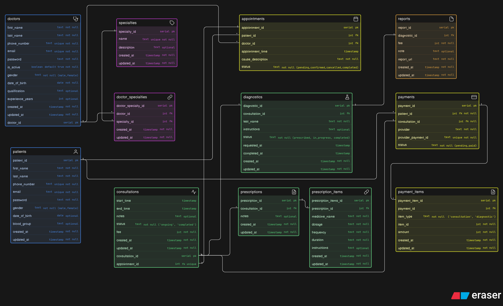

# Clinic Management Database

A database design for a clinic management system where doctors manage patients, handle appointments, conduct consultations, prescribe medicines, request diagnostics, and track payments.

## 📦 Core Entities

### Doctors

Stores doctor information, personal details, and education background.

### Patients

Stores patient information including personal details and basic medical data.

### Appointments

Stores appointments between doctors and patients.

### Consultations

Stores data about doctor-patient interactions.

### Diagnostics

Stores medical tests prescribed during a consultation.

### Prescriptions

Stores prescriptions given by doctors during consultations.

### Prescription Items

Stores individual medicines with details like dosage, frequency, and duration.

### Reports

Stores results of diagnostic tests, including report files and notes.

### Payments

Stores payments made by patients for consultations and diagnostics.

### Payment Items

Breaks down payments into individual components like consultation fees and diagnostic charges.

### Specialties

Stores different medical specialties like cardiology, dermatology, etc.

### Doctor Specialties

Maps doctors to their areas of specialization.

## 🔗 Relationships

- Patient → Appointments (1:M)
- Doctor → Appointments (1:M)

- Appointment → Consultation (1:1)

- Consultation → Diagnostics (1:M)
- Consultation → Prescriptions (1:M)

- Prescription → Prescription Items (1:M)

- Diagnostic → Reports (1:1)

- Consultation → Payments (1:M)
- Patient → Payments (1:M)

- Payment → Payment Items (1:M)

- Doctor → Doctor Specialties (1:M)
- Specialty → Doctor Specialties (1:M)
