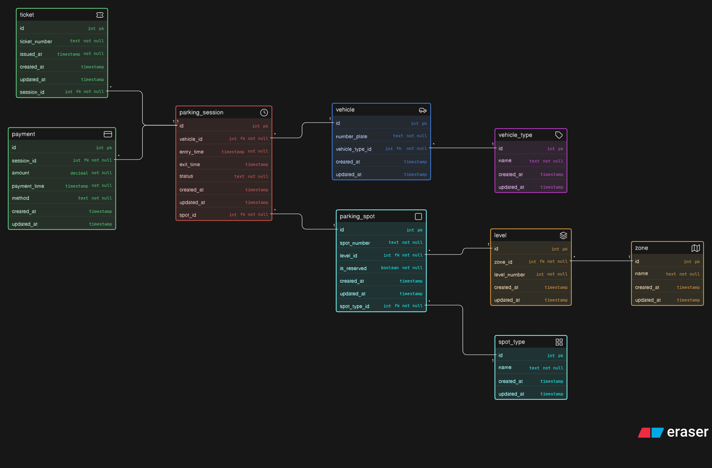

# Parking Management System

A database design for a large-scale event parking system where vehicles are managed across structured parking areas. This schema supports vehicle tracking, parking allocation, session management, ticketing, and payment workflows.

## 📦 Core Entities

### Vehicle

Stores vehicle details such as number plate and vehicle type.

### Vehicle Type

Defines categories of vehicles such as bike, car, SUV, and EV.

### Zone

Stores different parking sections like VIP, General, Staff, or EV.

### Level

Stores parking levels within a zone.

### Spot Type

Defines the type of parking spot based on vehicle compatibility.

### Parking Spot

Stores individual parking spaces including reservation status.

### Parking Session

Stores each parking event including entry and exit timestamps.

### Ticket

Stores ticket details issued during vehicle entry.

### Payment

Stores payment details including amount, method, and time.

## 🔗 Relationships

- Vehicle --> Parking Session (1:M)
- Parking Spot --> Parking Session (1:M)
- Vehicle Type --> Vehicle (1:M)
- Zone --> Level (1:M)
- Level --> Parking Spot (1:M)
- Spot Type --> Parking Spot (1:M)
- Parking Session --> Ticket (1:1)
- Parking Session --> Payment (1:1)
