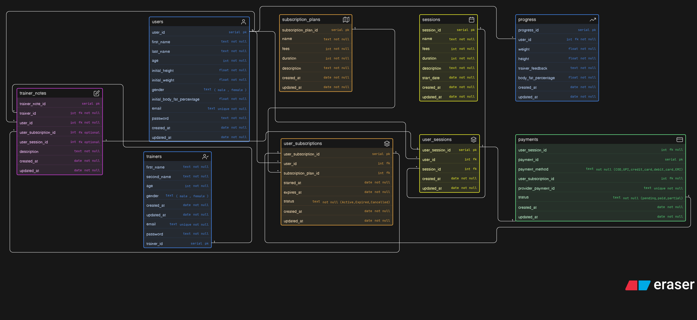

# 🏋️ Fitness Coaching & Subscription Management System

A database design for a fitness coaching platform where users can enroll in subscription plans, join training sessions, track progress, receive trainer feedback, and manage payments.

## 📦 Core Entities

### Users

Stores user information including personal details and initial fitness data.

### Trainers

Stores trainer information including personal details.

### Subscription Plans

Stores available fitness plans with pricing, duration, and description.

### User Subscriptions

Stores which user has subscribed to which plan along with status and validity.

### Sessions

Stores training sessions with details like duration, fees, and schedule.

### User Sessions

Stores which users are enrolled in which sessions.

### Trainer Notes

Stores feedback or notes given by trainers to users based on sessions or subscriptions.

### Payments

Stores payments made by users for subscriptions or sessions.

### Progress

Stores user fitness progress like weight, height, and body fat percentage over time.

## 🔗 Relationships

- User → User Subscriptions (1:M)
- Subscription Plan → User Subscriptions (1:M)

- User → User Sessions (1:M)
- Session → User Sessions (1:M)

- Trainer → Trainer Notes (1:M)
- User → Trainer Notes (1:M)
- User Subscription → Trainer Notes (1:M optional)
- User Session → Trainer Notes (1:M optional)

- User Subscription → Payments (1:1 optional)
- User Session → Payments (1:1 optional)

- User → Progress (1:M)
