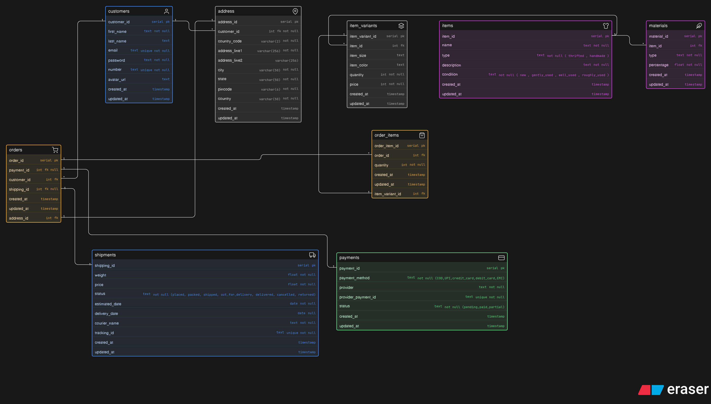

# Instagram Thrift Creator Store

A database design for an Instagram-based thrift store where creators sell thrifted fashion items and handmade products. This schema supports product variations, order management, payments, and shipping workflows.

## 📦 Core Entities

### Customers

Stores customer information including name, email, phone number, and avatar.

### Address

Stores customer addresses for order delivery.

### Items

Stores product details such as name, type (thrifted/handmade), description, and condition.

### Materials

Stores material composition of items (e.g., cotton 80%).

### Item Variants

Stores variations of items like size, color, quantity, and price.

### Orders

Stores customer orders along with linked address, payment, and shipment.

### Order Items

Stores items included in an order with quantity.

### Payments

Stores payment details including method, provider, and status.

### Shipments

Stores shipping and delivery details including tracking and status.

## 🔗 Relationships

- Customer --> Address (1:M)
- Customer --> Orders (1:M)
- Item --> Materials (1:M)
- Item --> Item Variants (1:M)
- Order --> Order Items (1:M)
- Order Item --> Item Variant (1:1)
- Order --> Address (1:1)
- Order --> Payment (1:1 optional)
- Order --> Shipment (1:1 optional)
