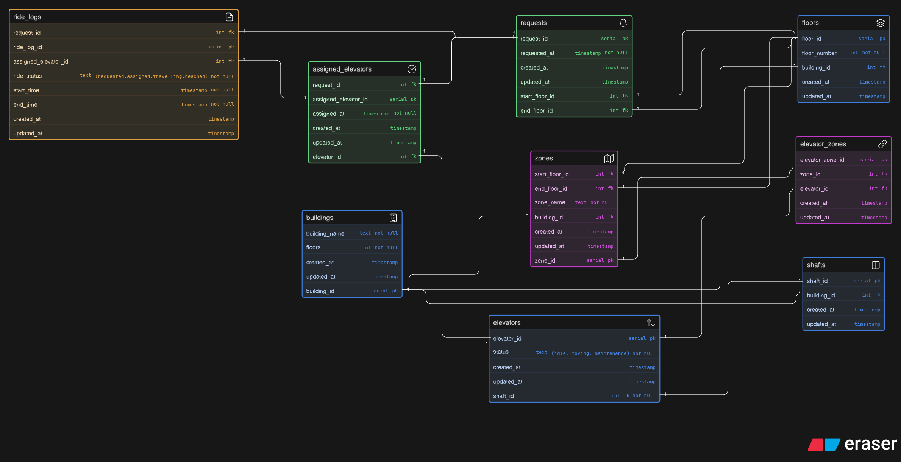

# Smart Elevator Control System

A database design for a large-scale smart elevator control platform where multiple elevators operate across multi-floor buildings. This schema supports elevator zoning, floor request handling, ride assignment, status tracking, and ride history logging.

## 📦 Core Entities

### Building

Stores building details such as name and total number of floors.

### Floor

Represents individual floors within a building.

### Shaft

Stores elevator shafts inside a building.

### Elevator

Stores elevator details including status and shaft assignment.

### Zone

Defines groups of floors within a building using start and end floor references.

### Elevator Zone

Maps elevators to zones, enabling multiple elevators to serve multiple zones.

### Request

Stores user-generated elevator requests with source and destination floors.

### Assigned Elevator

Stores which elevator is assigned to a request.

### Ride Log

Stores ride execution details including status and timestamps.

## 🔗 Relationships

- Building --> Floor (1:M)
- Building --> Shaft (1:M)
- Shaft --> Elevator (1:M)
- Building --> Zone (1:M)

- Zone --> Floor (via start_floor_id & end_floor_id)
- Elevator --> Elevator Zone (1:M)
- Zone --> Elevator Zone (1:M)

- Floor --> Request (1:M) _(as start and end floor)_
- Request --> Assigned Elevator (1:1)
- Elevator --> Assigned Elevator (1:M)

- Request --> Ride Log (1:1)
- Assigned Elevator --> Ride Log (1:1)
